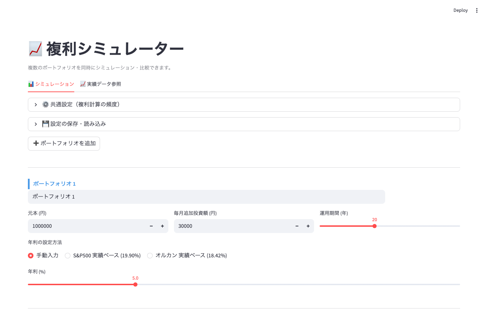
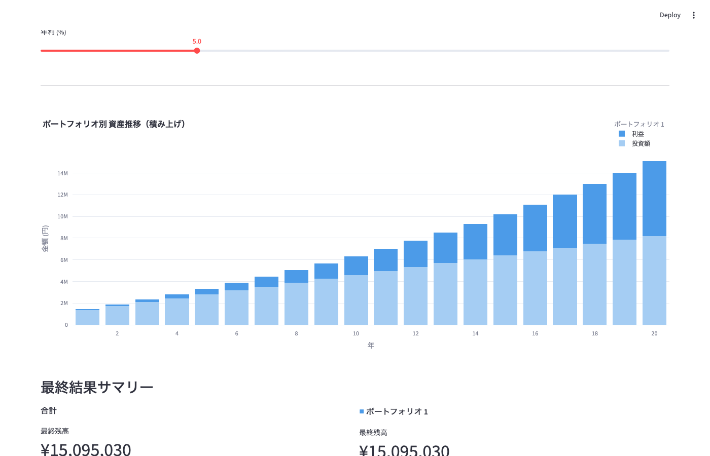
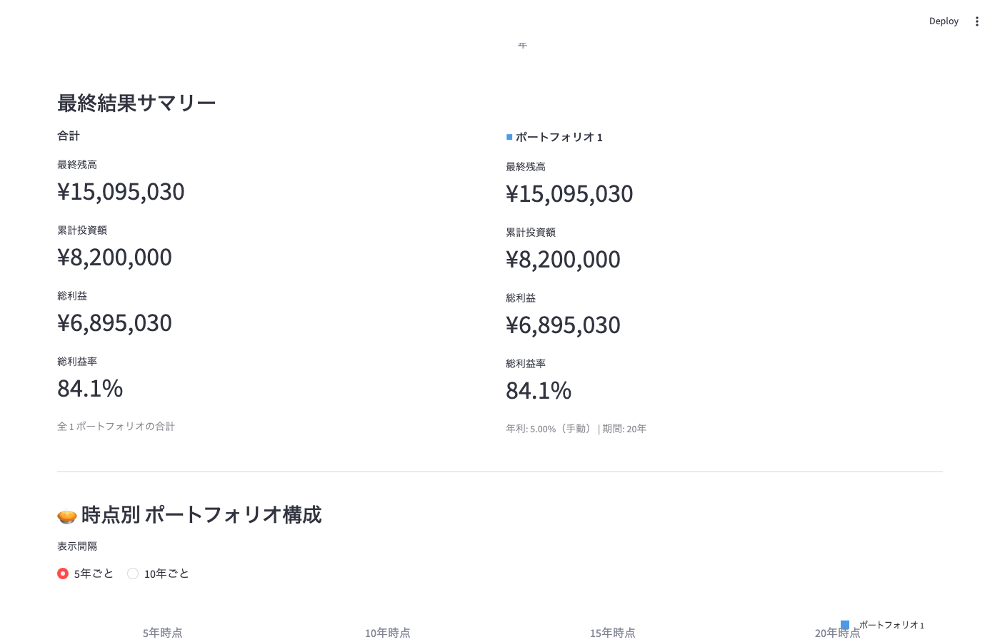
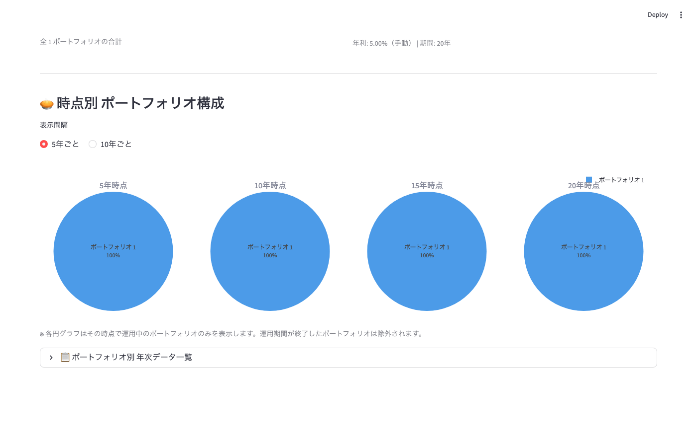
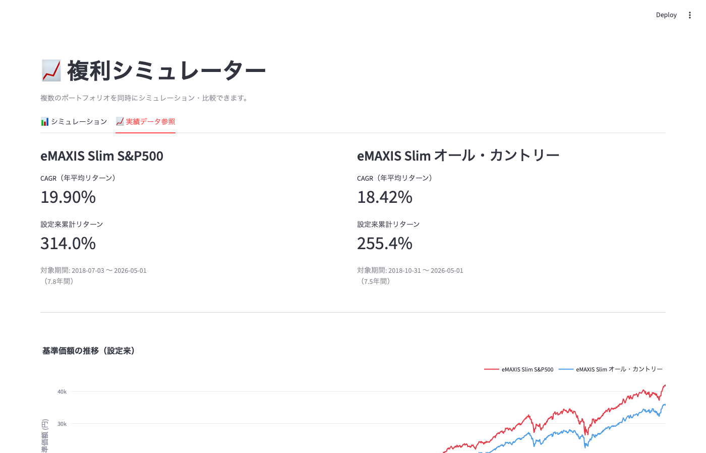

# 複利シミュレーター

元本・年利・運用期間・複利頻度・毎月の追加投資額を設定して、資産推移をシミュレーションするツールです。
CLIスクリプト版とブラウザGUI版の2形態があります。

## 必要環境

- [uv](https://docs.astral.sh/uv/) がインストールされていること

## セットアップ

```bash
# 依存パッケージのインストール
uv sync
```

---

## CLIスクリプト版

### 実行

```bash
uv run simulate.py
```

### パラメータの変更

`simulate.py` の冒頭にある定数を直接書き換えます。

```python
PRINCIPAL            = 1_000_000   # 元本 (円)
ANNUAL_RATE          = 0.05        # 年利 (0.05 = 5%)
YEARS                = 20          # 運用期間 (年)
COMPOUND_FREQ        = 12          # 複利頻度 (1=年, 4=四半期, 12=月, 365=日)
MONTHLY_CONTRIBUTION = 30_000      # 毎月の追加投資額 (円) ※0で積立なし
```

### 出力例

```
==============================================================
  複利シミュレーション結果
==============================================================
  元本          :    1,000,000 円
  年利          :        5.00 %
  運用期間      :          20 年
  複利頻度      :          12 回/年
  毎月追加投資  :       30,000 円
--------------------------------------------------------------
     年                残高           累計投資額              利益      利益率
--------------------------------------------------------------
     1年       1,421,062円     1,360,000円        61,062円     4.5%
    ...
    20年      15,095,030円     8,200,000円     6,895,030円    84.1%
==============================================================
  最終残高      :   15,095,030 円
  累計投資額    :    8,200,000 円
  総利益        :    6,895,030 円
  総利益率      :        84.1 %
==============================================================
```

---

## GUIアプリ版（ブラウザ）

### 起動

```bash
uv run streamlit run app.py
```

起動後、ブラウザで http://localhost:8501 を開きます。

---

## 画面紹介

### ポートフォリオ入力

複数のポートフォリオを追加・削除できます。各ポートフォリオに元本・毎月追加投資額・運用期間・年利（手動または実績ベース）を個別に設定できます。設定はJSONファイルで保存・読み込みが可能です。



---

### 資産推移グラフ（積み上げ棒グラフ）

全ポートフォリオの年次資産推移を積み上げ棒グラフで表示します。各ポートフォリオは色分けされ、淡色が累計投資額、濃色が利益を表します。



---

### 最終結果サマリー

運用終了時点の最終残高・累計投資額・総利益・総利益率を一覧表示します。一番左に全ポートフォリオの合計値が表示されます。



---

### 時点別ポートフォリオ構成（円グラフ）

5年または10年ごとの時点において、各ポートフォリオの資産残高の割合を円グラフで確認できます。運用期間が終了したポートフォリオは自動的に除外されます。



---

### 実績データ参照タブ

eMAXIS Slim S&P500 および eMAXIS Slim 全世界株式（オール・カントリー）の設定来NAV推移と年次リターンを確認できます。この実績値を年利として直接シミュレーションに使用することができます。



---

## 操作方法

| 操作場所 | 内容 |
|---|---|
| 💾 設定の保存・読み込み | ポートフォリオ設定をJSONでダウンロード・アップロード |
| ➕ ポートフォリオを追加 | 新しいポートフォリオカードを追加 |
| 各ポートフォリオカード | 元本・毎月追加投資・運用期間・年利を個別設定 |
| 年利の設定方法 | 手動入力 / S&P500実績 / オルカン実績 から選択 |
| ⚙️ 共通設定 | 複利計算の頻度（年・四半期・月・日）を設定 |
| 📈 実績データ参照タブ | ファンドの過去NAV推移・年次リターンを参照 |

### パラメータの設定範囲（各ポートフォリオ）

| パラメータ | 最小 | 最大 | デフォルト |
|---|---|---|---|
| 元本 | 0円 | 1億円 | 100万円 |
| 年利 | 0.1% | 20% | 5% |
| 運用期間 | 1年 | 50年 | 20年 |
| 毎月追加投資額 | 0円 | 100万円 | 3万円 |

---

## ファイル構成

```
compound_interest_simulator/
├── simulate.py               # コアロジック（CLIスクリプト兼モジュール）
├── app.py                    # Streamlit GUIアプリ
├── download_data.py          # ファンド実績データダウンロードスクリプト
├── capture_screenshots.py    # README用スクリーンショット取得スクリプト
├── data/                     # ダウンロードした実績データ（CSV）
├── docs/images/              # READMEに使用するスクリーンショット
├── pyproject.toml            # uvプロジェクト設定・依存関係
├── skill_compound_interest.md # 開発者向けプロジェクト品質ガイド
└── README.md                 # 本ファイル
```
